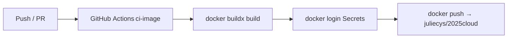

# 2025cloud 🚀

使用 GitHub Actions + Docker Hub 的最小範例：  
當程式碼推到 `main` 便自動打包成 Container Image 並推送到 **juliecys/2025cloud**，供任何環境直接拉取執行。

---

## 前置需求

| 工具 | 版本建議 | 用途 |
|------|----------|------|
| Docker Desktop / Engine | ≥ 23.x | 本機 Build / Run Image |
| Git | ≥ 2.30 | 版本控制、推送至 GitHub |

---

## Quick Start

### 1 Build — 打包成 Container Image
```bash
docker build -t juliecys/2025cloud:local .
````

> `docker build` 會讀取專案根目錄的 **Dockerfile**。
> 完成後於 `docker images` 可看到 `juliecys/2025cloud:local`。

### 2 Run — 在本機執行剛打好的 Image

```bash
docker run --rm -p 3000:3000 juliecys/2025cloud:local
# 瀏覽器開 http://localhost:3000
```

> `-p 3000:3000` 把容器內的 3000 埠映射到主機，瀏覽器即可看到 **Hello 2025cloud**。

---

## 直接從 Docker Hub 取得最新映像

```bash
docker pull juliecys/2025cloud:latest
docker run --rm -p 3000:3000 juliecys/2025cloud:latest
```

---

## 開發—熱重載 (可選)

```bash
docker run --rm -p 3000:3000 -v $(pwd):/app \
  --entrypoint sh juliecys/2025cloud:local \
  -c "npm i -g nodemon && nodemon server.js"
```

---

## CI/CD 流程（Mermaid）



> 任何 **push 到 `main`** 或 **提出 PR** 都會觸發 `ci-image` workflow
> 流程：Checkout → Buildx → Login → Push

---

### Tag 產生策略

| 觸發情境                        | 產生 Tag              | 用途 / 原因                   |
| --------------------------- | ------------------- | ------------------------- |
| `main` push                 | `latest`、`sha-<7碼>` | `latest` 給一般使用；`sha` 便於回溯 |
| Pull Request                | *(只 build，不推)*      | 驗證 build，不污染正式 registry   |
| 發 Release Tag `vX.Y.Z`（未啟用） | `vX.Y.Z`、`latest`   | 日後發行穩定版時使用                |

> **設計理念**
>
> * 正式分支產生 `latest`，確保「永遠有最新版」
> * `sha` tag 讓歷史映像可精準拉回
> * PR 階段僅 build，避免測試映像進入 Docker Hub
> * 發行版只要 `git tag v1.0.0`，同一 workflow 就能推送 `v1.0.0`

---

## 專案結構 (精簡)

```
.
├── Dockerfile
├── server.js            # 最小 Node.js HTTP 伺服器
├── README.md
└── .github/
    └── workflows/
        └── docker.yml   # CI 配置
```

---

## 常見問題

| 症狀                                                   | 排查方向                                           |
| ---------------------------------------------------- | ---------------------------------------------- |
| `no basic auth credentials`                          | Secrets 名稱正確？ `docker/login-action` 有執行？       |
| `denied: requested access to the resource is denied` | Docker Hub repo 是否 Public？ `images:` 行帳號拼字正確？  |
| CI 綠燈但 Docker Hub 沒 tag                              | YAML 條件 `push:` 被限制在特定分支；可改成 `push: true` 強制上傳 |

---

## License

MIT
